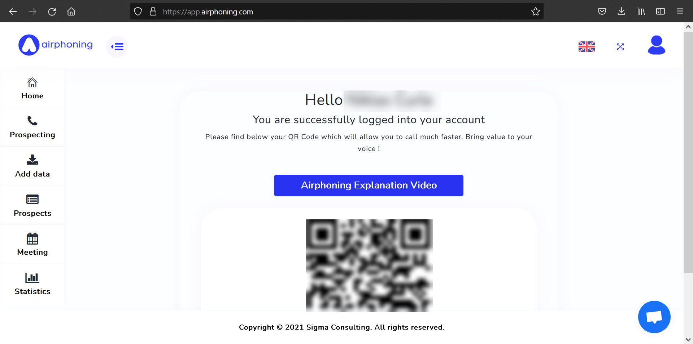
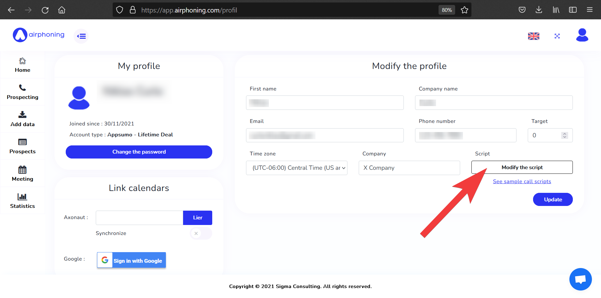

# Getting Started with AirPhoning

This guide will help with setting up your profile, importing prospects, and making your first calls using Airphoning.

## Logging in
From [Airphoning.com](http://airphoning.com), log into AirPhoning using your email and password. 

 

You will then be taken to the application's **Home** screen.

## Setting up your profile

Upon logging in to Airphoning for the first time, you may set up your personal profile. Enter your personal information, email, phone number, time zone, company name, and even a target goal for meetings you want to schedule with prospects.

On this page is the `Modify the script` button identified by the arrow above. Here, you can add and edit your cold calling script that will appear in front of you during every call.

For cold calling script ideas, see [sample call scripts](https://airphoning.com/how-to-structure-your-cold-calling-scripts/ "sample call scripts"). 

## Importing prospects

Prospect data is uploaded to Airphoning via a CSV file. Make sure you have the information for these categories on hand:

- Company name
- Company registration number
- Phone number
- Address
- Country/State
- Company activity/industry
- Type of business
- CEO

How to create and import a .csv file of your prospects:

1. Create a .csv file of your prospects using [this formatted .csv file](https://app.airphoning.com/CSV-EXAMPLE-AIRPHONING.csv "this format"). Populate the fields in the spreadsheet with information about your prospects. 
2. On the **Home** screen, click on the **Add data** button. Then on the next screen open the dialog and find the .csv file on your computer.
	* Tip: You can also input prospect information manually by clicking the `Add a prospect manually` button.
3. On the following *Configure your file* page, use the dropdown menus to match the columns in the .csv file with the categories. Do for all categories.

    - Example: Matching the column heading *COMPANY NAME* from the .csv file with the corresponding category. 

4. Click `Add prospects` to complete the process.

Check that your prospects have imported correctly by clicking the **Prospects** button on the **Home** page.

## Managing prospects

On the **Prospects** page you can view all of your imported prospects. Use the search bar to look for a specific prospect and sort the list of prospects by clicking on the category of your choosing. 

Click on a prospect to view more detailed information about the prospect, including the current state of the prospect, additional contact information, and any comments on this prospect. 

Every prospect entry has editing tools for editing the prospect's information or deleting the prospect. 

## Making calls

To make prospect calls, start on the **Home** page and scan the QR code or type the link into your phone. This will then open the Airphoning website in your default mobile Internet browser. {: style="height:600px;width:300px"} 

Click the `Call` button to begin your first prospect call.

Click the dialog with the phone number to initiate the call. 

{: style="height:600px;width:300px"}

Back on your computer, click on **Prospecting**. Here you view see all the information about the current prospect, the script, and a "Prospect Status" section. After your call is complete, you can change the state of this prospect to reflect how the phone call went. For example, if the prospect wants to schedule another meeting, select `Meeting taken` and a date and time for the meeting (this information can be viewed later on the **Meeting** page). If the prospect wasn't interested, select `Not interested`. Other options are available to reflect how the calls went. 

Underneath the `State` menu are areas to fill in additional contact information or write a comment about the prospect. You can also check "Generate PDF" to generate a PDF document of information about the prospect and meeting details for later use.

## Statistics
At the top of the **Prospecting** page is an area with data on the number of cold calls, how many meetings you received, and how close you are to your target number of meetings (if you've set up a target in your profile). 

On the **Statistics** page you can view statistics on your calls and meetings. See the trends of the number of outgoing calls per day and how many meetings you scheduled. You can notice what days are most successful at leading to meetings, which days are most popular for meetings, and if the number of calls and meetings are related. An example day is highlighted below. 

## Other uses - meetings calendar
On the **Meetings** page you can view all the meetings you have scheduled. Edit meeting details to change the time and date of the meeting, as well as change the state of the meeting if it gets canceled, for instance. 

If you want to schedule a meeting with a specific prospect outside of your normal cold calls, click `Add a meeting`. This might be a scenario if you receive a return call from a prospect.