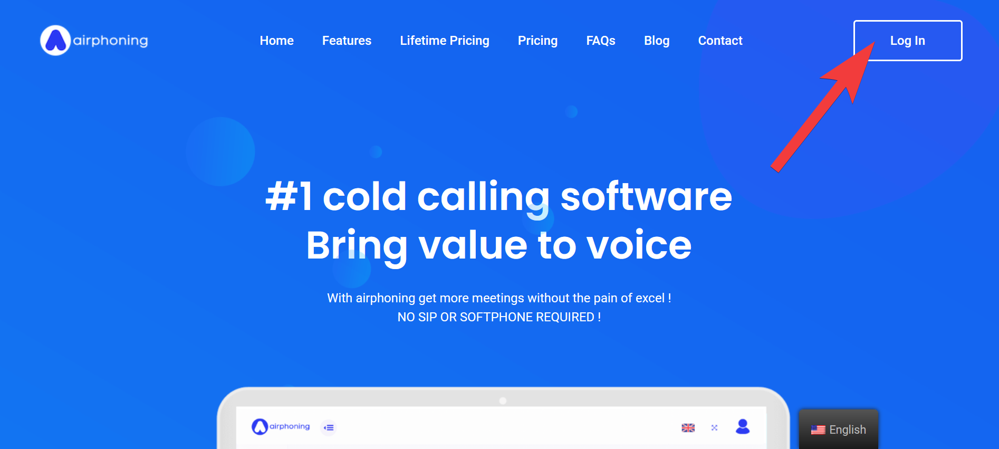
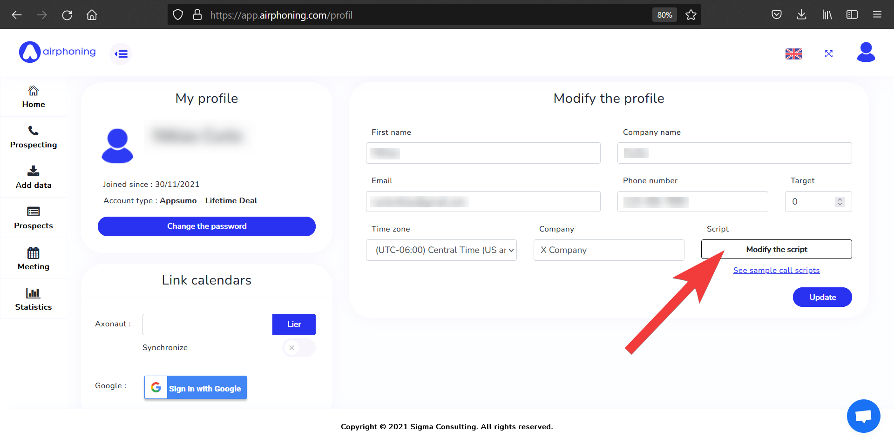

# Getting Started with AirPhoning

This guide will help you set up your profile, import prospects, and make your first calls using Airphoning.

The guide will cover the following areas:

1. Site interface
2. Setting up your profile and importing prospects
3. Managing prospects
4. Making calls
5. Using statistics
6. Other uses

## Logging in
From [Airphoning.com](http://airphoning.com), log into AirPhoning using your email and password. 

 

You will then be taken to the application's home screen:

## Setting up your profile

Upon logging in to Airphoning for the first time, you can set up your personal profile. Enter your personal information, email, phone number, time zone, company name, and even a target goal for meetings you want to schedule with prospects.

On this page is also the `Modify the script` button, identified by the arrow in the picture above. Here, you can add and edit your cold calling script that will appear in front of you during every call you make.

For cold calling script ideas, see [sample call scripts](https://airphoning.com/how-to-structure-your-cold-calling-scripts/ "sample call scripts"). 

## Importing prospects

Prospect data is uploaded to Airphoning via a CSV file. Do the following:

1. Create a .csv file of your prospects using [this formatted .csv file](https://app.airphoning.com/CSV-EXAMPLE-AIRPHONING.csv "this format"). Populate the fields in the spreadsheet with information about your prospects. 
2. Click on the **Add data** button on the left side of the home screen, then on the next screen open the dialog and navigate to the .csv file on your computer.
	* You can also input prospect information manually by clicking the `Add a prospect manually` button.
3. On the following *Configure your file* page, use the dropdown menus to match the columns in the .csv file with the categories.
4. Click `Add prospects` to complete the process

Check that your prospects imported correctly by clicking the **Prospects** button on the home page.

## Managing prospects

On the **Prospects** page you can view all of your imported prospects. Use the search bar to look for a specific prospect and sort the list of prospects by clicking on the category of your choosing. 

Click on a prospect to view more detailed information about the prospect, including the current state of the prospect, additional contact information, and any comments on this prospect. 

Each prospect entry has editing tools where you can edit the prospect's information or delete the prospect. 

## Making calls

To make prospect calls, start on the **Home** page and scan the QR code or type the link on into your phone. This will take you to a Airphoning website page where you can begin your calls. Click the `Call` button on the next page to call your first prospect.

Back on your computer, click on **Prospecting**. Here you view see all the information about the current prospect, the script, and a "Prospect Status" section. After your call is complete, you can change the state of this prospect to reflect how the phone call went. For example, if the prospect wants to schedule another meeting, select `Meeting taken` and a date and time for the meeting (this information can be viewed later on the **Meeting** page). If the prospect wasn't interested, select `Not interested`. Other options are available to reflect how the calls went.

Underneath the `State` menu are areas to fill in additional contact information or write a comment about the prospect. You can also check "Generate PDF" to generate a PDF document of information about the prospect and meeting details for later use.

## Statistics
At the top of the **Prospecting** page is an area with data on your number of cold calls, how many meetings you received, and how close you are to your target number of meetings (if you've set up a target in your profile).

On the **Statistics** page you can view statistics on your calls and meetings. See the trend of your number of outgoing calls per day and how many meetings you schedule. You can notice what days have the most success at leading to meetings, which days are most popular for meetings, and if the number of calls and meetings are related.

## Other uses - meetings calendar
On the **Meetings** page you can view all the meetings you have scheduled. Edit meeting details to change the time and date of the meeting, as well as change the state of the meeting if it gets canceled.

If you want to schedule a meeting with a specific prospect outside of your normal cold call sessions, click `Add a meeting`. This may happen if you receive a return call from a prospect.

## Additional help

See the [User Guide](/user_guide) for more information about Airphoning's features.